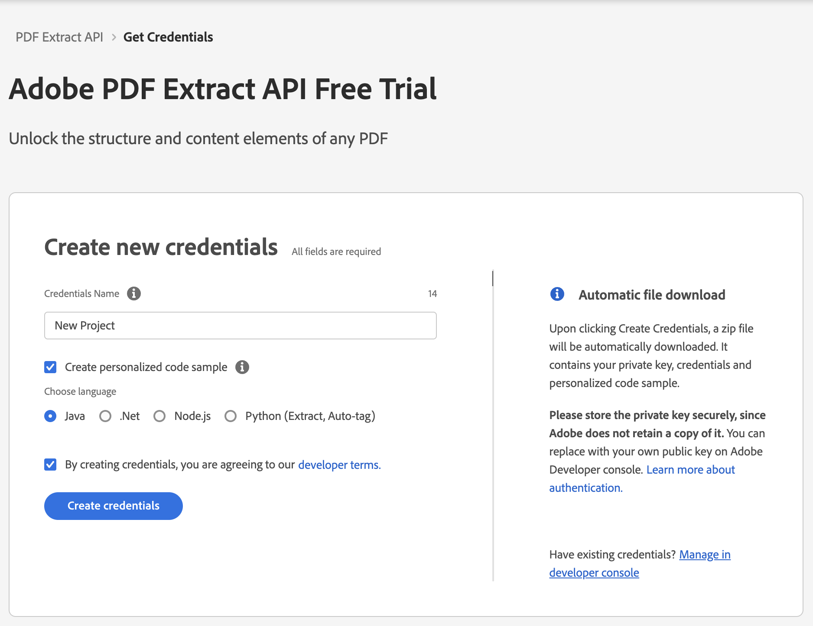
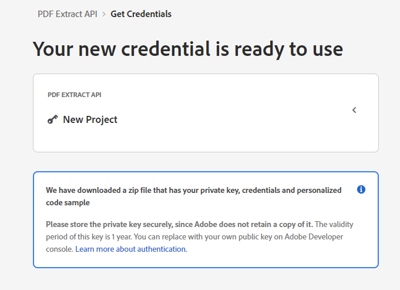
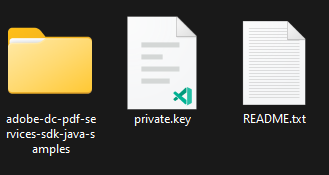

# Quickstart for PDF Extract API (Java)

To get started using Adobe PDF Extract API, let's walk through a simple scenario - taking an input PDF document and running PDF Extract API against it. Once the PDF has been extracted, we'll parse the results and report on any major headers in the document. In this guide, we will walk you through the complete process for creating a program that will accomplish this task. 

## Prerequisites

To complete this guide, you will need:

* [Java](http://www.oracle.com/technetwork/java/javase/downloads/index.html) - Java 8 or higher is required. 
* [Maven](https://maven.apache.org/install.html)
* An Adobe ID. If you do not have one, the credential setup will walk you through creating one.
* A way to edit code. No specific editor is required for this guide.

## Step One: Getting credentials

1) To begin, open your browser to <https://acrobatservices.adobe.com/dc-integration-creation-app-cdn/main.html?api=pdf-extract-api>. If you are not already logged in to Adobe.com, you will need to sign in or create a new user. Using a personal email account is recommend and not a federated ID.


2) After registering or logging in, you will then be asked to name your new credentials. Use the name, "New Project". 

3) Change the "Choose language" setting to "Java". 

4) Also note the checkbox by, "Create personalized code sample." This will include a large set of samples along with your credentials. These can be helpful for learning more later. 

5) Click the checkbox saying you agree to the developer terms and then click "Create credentials."



6) After your credentials are created, they are automatically  downloaded:



## Step Two: Setting up the project

1) In your Downloads folder, find the ZIP file with your credentials: PDFServicesSDK-JavaSamples.zip. If you unzip that archive, you will find a README file, your private key, and a folder of samples:



2) We need two things from this download. The `private.key` file (as shown in the screenshot above, and the `pdfservices-api-credentials.json` file found in the samples directory:


<InlineAlert slots="text" />

Note that that private key is *also* found in this directory so feel free to copy them both from here.

3) Take these two files and place them in a new directory.

4) In this directory, create a new file named `pom.xml` and copy the following contents:

```xml
<?xml version="1.0" encoding="UTF-8"?>

<project xmlns="http://maven.apache.org/POM/4.0.0"
         xmlns:xsi="http://www.w3.org/2001/XMLSchema-instance"
         xsi:schemaLocation="http://maven.apache.org/POM/4.0.0 http://maven.apache.org/xsd/maven-4.0.0.xsd">
  <modelVersion>4.0.0</modelVersion>

  <groupId>com.adobe.documentservices</groupId>
  <artifactId>pdfservices-sdk-extract-guide</artifactId>
  <version>1</version>

  <name>PDF Services Java SDK Samples</name>

  <properties>
    <project.build.sourceEncoding>UTF-8</project.build.sourceEncoding>
    <maven.compiler.source>1.8</maven.compiler.source>
    <maven.compiler.target>1.8</maven.compiler.target>
    <pdfservices.sdk.version>2.2.2</pdfservices.sdk.version>
  </properties>

  <dependencies>

    <dependency>
      <groupId>com.adobe.documentservices</groupId>
      <artifactId>pdfservices-sdk</artifactId>
      <version>${pdfservices.sdk.version}</version>
    </dependency>

    <!--		log4j2 dependency to showcase the use of log4j2 with slf4j API-->
    <!-- https://mvnrepository.com/artifact/org.slf4j/slf4j-log4j12 -->
    <dependency>
      <groupId>org.apache.logging.log4j</groupId>
      <artifactId>log4j-slf4j-impl</artifactId>
      <version>2.17.1</version>
    </dependency>
  </dependencies>

  <build>
    <plugins>
      <plugin>
        <groupId>org.apache.maven.plugins</groupId>
        <artifactId>maven-compiler-plugin</artifactId>
        <version>3.8.0</version>
        <configuration>
          <source>${maven.compiler.source}</source>
          <target>${maven.compiler.target}</target>
        </configuration>
      </plugin>
      <plugin>
        <groupId>org.apache.maven.plugins</groupId>
        <artifactId>maven-shade-plugin</artifactId>
        <version>3.2.4</version>
        <configuration>
          <filters>
            <filter>
              <artifact>*:*</artifact>
              <excludes>
                <exclude>META-INF/*.SF</exclude>
                <exclude>META-INF/*.DSA</exclude>
                <exclude>META-INF/*.RSA</exclude>
              </excludes>
            </filter>
          </filters>
        </configuration>
        <executions>
          <execution>
            <phase>package</phase>
            <goals>
              <goal>shade</goal>
            </goals>
          </execution>
        </executions>
      </plugin>
      <plugin>
        <groupId>org.apache.maven.plugins</groupId>
        <artifactId>maven-jar-plugin</artifactId>
        <version>3.0.2</version>
        <configuration>
          <archive>
            <manifest>
              <addClasspath>true</addClasspath>
              <classpathPrefix>lib/</classpathPrefix>
              <mainClass>ExtractTextInfoFromPDF</mainClass>
            </manifest>
          </archive>
        </configuration>
      </plugin>
      <plugin>
        <groupId>org.codehaus.mojo</groupId>
        <artifactId>exec-maven-plugin</artifactId>
        <version>1.5.0</version>
        <executions>
          <execution>
            <goals>
              <goal>java</goal>
            </goals>
          </execution>
        </executions>
      </plugin>
    </plugins>
  </build>
</project>
```

This file will define what dependencies we need and how the application will be built. 

Our application will take a PDF, `Adobe Extract API Sample.pdf` (downloadable from [here](/Adobe%20Extract%20API%20Sample.pdf)) and extract it's contents. The results will be saved as a ZIP file, `ExtractTextInfoFromPDF.zip`. We will then parse the results from the ZIP and print out the text of any `H1` headers found in the PDF.

5) In your editor, open the directory where you previously copied the credentials, and create a new directory, `src/main/java`. In that directory, create `ExtractTextInfoFromPDF.java`. 

Now you're ready to begin coding.

## Step Three: Creating the application

1) We'll begin by including our required dependencies:

```java
import com.adobe.pdfservices.operation.ExecutionContext;
import com.adobe.pdfservices.operation.auth.Credentials;
import com.adobe.pdfservices.operation.exception.SdkException;
import com.adobe.pdfservices.operation.exception.ServiceApiException;
import com.adobe.pdfservices.operation.exception.ServiceUsageException;
import com.adobe.pdfservices.operation.io.FileRef;
import com.adobe.pdfservices.operation.pdfops.ExtractPDFOperation;
import com.adobe.pdfservices.operation.pdfops.options.extractpdf.ExtractElementType;
import com.adobe.pdfservices.operation.pdfops.options.extractpdf.ExtractPDFOptions;
import org.slf4j.LoggerFactory;

import java.io.IOException;
import java.nio.file.Files;
import java.nio.file.Paths;
import java.util.Arrays;

import java.util.zip.*;
import java.io.InputStream;
import java.util.Scanner;

import org.json.JSONArray;
import org.json.JSONObject;
```

2) Now let's define our main class:

```java
public class ExtractTextInfoFromPDF {

    private static final org.slf4j.Logger LOGGER = LoggerFactory.getLogger(ExtractTextInfoFromPDF.class);

    public static void main(String[] args) {

	}
}
```

3) Now let's define our input and output:

```java
String zip_file = "./ExtractTextInfoFromPDF.zip";
Files.deleteIfExists(Paths.get(zip_file));

String input_file = "./Adobe Extract API Sample.pdf";
```

This defines what our output ZIP will be and optionally deletes it if it already exists. Then we define what PDF will be extracted. (You can download the source we used [here](/Adobe%20Extract%20API%20Sample.pdf).) In a real application, these values would be typically be dynamic. 

4) Next, we can create our credentials and use them:

```java
// Initial setup, create credentials instance.
Credentials credentials = Credentials.serviceAccountCredentialsBuilder()
		.fromFile("pdfservices-api-credentials.json")
		.build();

// Create an ExecutionContext using credentials.
ExecutionContext executionContext = ExecutionContext.create(credentials);
```

5) Now, let's create the operation:

```java
ExtractPDFOperation extractPDFOperation = ExtractPDFOperation.createNew();

// Provide an input FileRef for the operation
FileRef source = FileRef.createFromLocalFile(input_file);
extractPDFOperation.setInputFile(source);

// Build ExtractPDF options and set them into the operation
ExtractPDFOptions extractPDFOptions = ExtractPDFOptions.extractPdfOptionsBuilder()
		.addGetStylingInfo(false)
		.addElementsToExtract(Arrays.asList(ExtractElementType.TEXT, ExtractElementType.TABLES))
		.build();
extractPDFOperation.setOptions(extractPDFOptions);
```

This set of code defines what we're doing (an Extract operation), points to our local file and specifies the input is a PDF, and then defines options for the Extract call. PDF Extract API has a few different options, but in this example, we're simply asking for the most basic of extractions, the textual content of the document. 

6) The next code block executes the operation:

```java
// Execute the operation
FileRef result = extractPDFOperation.execute(executionContext);

// Save the result at the specified location
result.saveAs(zip_file);
```

This code runs the Extraction process and then stores the result zip to the file system. 

7) In this block, we read in the ZIP file, extract the JSON result file, and parse it:

```java
ZipFile resultZip = new ZipFile(zip_file);
ZipEntry jsonEntry = resultZip.getEntry("structuredData.json");
InputStream is = resultZip.getInputStream(jsonEntry);
Scanner s = new Scanner(is).useDelimiter("\\A");
String jsonString = s.hasNext() ? s.next() : "";
s.close();

JSONObject jsonData = new JSONObject(jsonString);
```

8) Finally we can loop over the result and print out any found element that is an `H1`:

```java
JSONArray elements = jsonData.getJSONArray("elements");
for(int i=0; i < elements.length(); i++) {
    JSONObject element = elements.getJSONObject(i);
    String path = element.getString("Path");
    if(path.endsWith("/H1")) {
        String text = element.getString("Text");
        System.out.println(text);
    }
}
```


Here's the complete application (`src/java/main/ExtractTextInfoFromPDF.java`):

```java
import com.adobe.pdfservices.operation.ExecutionContext;
import com.adobe.pdfservices.operation.auth.Credentials;
import com.adobe.pdfservices.operation.exception.SdkException;
import com.adobe.pdfservices.operation.exception.ServiceApiException;
import com.adobe.pdfservices.operation.exception.ServiceUsageException;
import com.adobe.pdfservices.operation.io.FileRef;
import com.adobe.pdfservices.operation.pdfops.ExtractPDFOperation;
import com.adobe.pdfservices.operation.pdfops.options.extractpdf.ExtractElementType;
import com.adobe.pdfservices.operation.pdfops.options.extractpdf.ExtractPDFOptions;
import org.slf4j.LoggerFactory;

import java.io.IOException;
import java.nio.file.Files;
import java.nio.file.Paths;
import java.util.Arrays;

import java.util.zip.*;
import java.io.InputStream;
import java.util.Scanner;

import org.json.JSONArray;
import org.json.JSONObject;

public class ExtractTextInfoFromPDF {

    private static final org.slf4j.Logger LOGGER = LoggerFactory.getLogger(ExtractTextInfoFromPDF.class);

    public static void main(String[] args) {

        try {

            String zip_file = "./ExtractTextInfoFromPDF.zip";
            Files.deleteIfExists(Paths.get(zip_file));

            String input_file = "./Adobe Extract API Sample.pdf";

            // Initial setup, create credentials instance.
            Credentials credentials = Credentials.serviceAccountCredentialsBuilder()
                    .fromFile("pdfservices-api-credentials.json")
                    .build();

            // Create an ExecutionContext using credentials.
            ExecutionContext executionContext = ExecutionContext.create(credentials);

            ExtractPDFOperation extractPDFOperation = ExtractPDFOperation.createNew();

            // Provide an input FileRef for the operation
            FileRef source = FileRef.createFromLocalFile(input_file);
            extractPDFOperation.setInputFile(source);

            // Build ExtractPDF options and set them into the operation
            ExtractPDFOptions extractPDFOptions = ExtractPDFOptions.extractPdfOptionsBuilder()
                    .addGetStylingInfo(false)
                    .addElementsToExtract(Arrays.asList(ExtractElementType.TEXT, ExtractElementType.TABLES))
                    .build();
            extractPDFOperation.setOptions(extractPDFOptions);

            // Execute the operation
            FileRef result = extractPDFOperation.execute(executionContext);

            // Save the result at the specified location
            result.saveAs(zip_file);

      		System.out.println("Successfully extracted information from PDF. Printing H1 Headers:\n");

            ZipFile resultZip = new ZipFile(zip_file);
            ZipEntry jsonEntry = resultZip.getEntry("structuredData.json");
            InputStream is = resultZip.getInputStream(jsonEntry);
            Scanner s = new Scanner(is).useDelimiter("\\A");
            String jsonString = s.hasNext() ? s.next() : "";
            s.close();

            JSONObject jsonData = new JSONObject(jsonString);
            JSONArray elements = jsonData.getJSONArray("elements");
            for(int i=0; i < elements.length(); i++) {
                JSONObject element = elements.getJSONObject(i);
                String path = element.getString("Path");
                if(path.endsWith("/H1")) {
                    String text = element.getString("Text");
                    System.out.println(text);
                }
            }
            

        } catch (ServiceApiException | IOException | SdkException | ServiceUsageException e) {
            LOGGER.error("Exception encountered while executing operation", e);
        }
    }
}
```

## Next Steps

Now that you've successfully performed your first operation, [review the documentation](https://developer.adobe.com/document-services/docs/overview/pdf-services-api/) for many other examples and reach out on our [forums](https://community.adobe.com/t5/document-services-apis/ct-p/ct-Document-Cloud-SDK) with any questions. Also remember the samples you downloaded while creating your credentials also have many demos.
