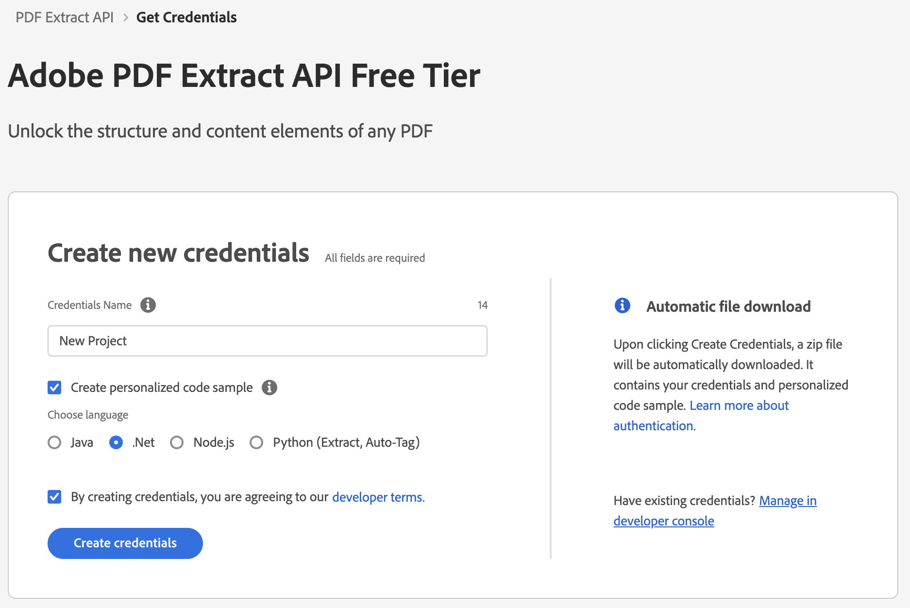
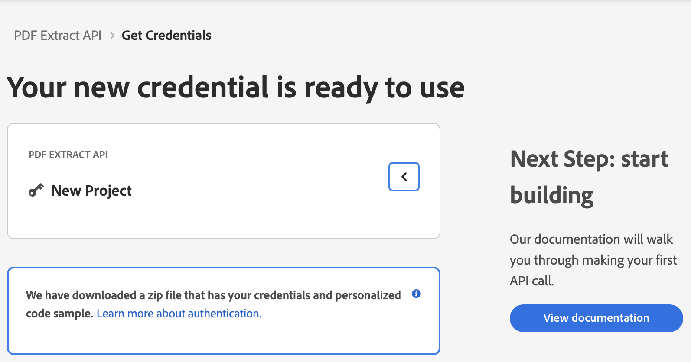

# Quickstart for PDF Extract API (.NET)

To get started using Adobe PDF Extract API, let's walk through a simple scenario - taking an input PDF document and running PDF Extract API against it. Once the PDF has been extracted, we'll parse the results and report on any major headers in the document. In this guide, we will walk you through the complete process for creating a program that will accomplish this task. 

## Prerequisites

To complete this guide, you will need:

* [.NET: version 6.0 or above](https://dotnet.microsoft.com/en-us/download)
* [.Net SDK](https://dotnet.microsoft.com/en-us/download/dotnet/6.0)
* A build tool: Either Visual Studio or .NET Core CLI.
* An Adobe ID. If you do not have one, the credential setup will walk you through creating one.
* A way to edit code. No specific editor is required for this guide.
  
## Step One: Getting credentials

1) To begin, open your browser to <https://acrobatservices.adobe.com/dc-integration-creation-app-cdn/main.html?api=pdf-extract-api>. If you are not already logged in to Adobe.com, you will need to sign in or create a new user. Using a personal email account is recommend and not a federated ID.


2) After registering or logging in, you will then be asked to name your new credentials. Use the name, "New Project". 

3) Change the "Choose language" setting to ".Net". 

4) Also note the checkbox by, "Create personalized code sample." This will include a large set of samples along with your credentials. These can be helpful for learning more later. 

5) Click the checkbox saying you agree to the developer terms and then click "Create credentials."



6) After your credentials are created, they are automatically  downloaded:



## Step Two: Setting up the project

1) In your Downloads folder, find the ZIP file with your credentials: PDFServicesSDK-.NetSamples.zip. If you unzip that archive, you will find a folder of samples and the `pdfservices-api-credentials.json` file.


2) Take the `pdfservices-api-credentials.json` file and place it in a new directory.

3) In your new directory, create a new file, `ExtractTextInfoFromPDF.csproj`. This file will declare our requirements as well as help define the application we're creating.

```xml
<Project Sdk="Microsoft.NET.Sdk">

    <PropertyGroup>
        <OutputType>Exe</OutputType>
        <TargetFramework>netcoreapp3.1</TargetFramework>
    </PropertyGroup>

    <ItemGroup>
        <PackageReference Include="log4net" Version="2.0.12" />
        <PackageReference Include="Adobe.PDFServicesSDK" Version="3.4.0" />
    </ItemGroup>

    <ItemGroup>
        <None Update="extractPDFInput.pdf">
            <CopyToOutputDirectory>Always</CopyToOutputDirectory>
        </None>
        <None Update="log4net.config">
            <CopyToOutputDirectory>Always</CopyToOutputDirectory>
        </None>
    </ItemGroup>

</Project>
```

Our application will take a PDF, `Adobe Extract API Sample.pdf` (downloadable from [here](/Adobe%20Extract%20API%20Sample.pdf)) and extract it's contents. The results will be saved as a ZIP file, `ExtractTextInfoFromPDF.zip`. We will then parse the results from the ZIP and print out the text of any `H1` headers found in the PDF.

4) In your editor, open the directory where you previously copied the credentials and created the `csproj` file. Create a new file, `Program.cs`. 

Now you're ready to begin coding.

## Step Three: Creating the application

1) We'll begin by including our required dependencies:

```javascript
using System.Text.Json;
using System.IO.Compression;
using System.IO;
using System;
using System.Collections.Generic;
using log4net.Repository;
using log4net.Config;
using log4net;
using System.Reflection;
using Adobe.PDFServicesSDK;
using Adobe.PDFServicesSDK.auth;
using Adobe.PDFServicesSDK.pdfops;
using Adobe.PDFServicesSDK.io;
using Adobe.PDFServicesSDK.exception;
using Adobe.PDFServicesSDK.options.extractpdf;
```

2) Now let's define our main class and `Main` method:

```javascript
namespace ExtractTextInfoFromPDF
{
    class Program
    {
        private static readonly ILog log = LogManager.GetLogger(typeof(Program));
        static void Main()
        {
		}
	}
}
```

3) Now let's define our input and output:

```javascript
String input = "Adobe Extract API Sample.pdf";

String output = "ExtractTextInfoFromPDF.zip";
if(File.Exists(Directory.GetCurrentDirectory() + output))
{
	File.Delete(Directory.GetCurrentDirectory() + output);
}
```

This defines what our output ZIP will be and optionally deletes it if it already exists. Then we define what PDF will be extracted. (You can download the source we used [here](/Adobe%20Extract%20API%20Sample.pdf).) In a real application, these values would be typically be dynamic. 

4) Set the environment variables `PDF_SERVICES_CLIENT_ID` and `PDF_SERVICES_CLIENT_SECRET` by running the following commands and replacing placeholders `YOUR CLIENT ID` and `YOUR CLIENT SECRET` with the credentials present in `pdfservices-api-credentials.json` file:
- **Windows:**
    - `set PDF_SERVICES_CLIENT_ID=<YOUR CLIENT ID>`
    - `set PDF_SERVICES_CLIENT_SECRET=<YOUR CLIENT SECRET>`

- **MacOS/Linux:**
    - `export PDF_SERVICES_CLIENT_ID=<YOUR CLIENT ID>`
    - `export PDF_SERVICES_CLIENT_SECRET=<YOUR CLIENT SECRET>`

5) Next, we setup the SDK to use our credentials.

```javascript
// Initial setup, create credentials instance.
Credentials credentials = Credentials.ServicePrincipalCredentialsBuilder()
    .WithClientId("PDF_SERVICES_CLIENT_ID")
    .WithClientSecret("PDF_SERVICES_CLIENT_SECRET")
    .Build();

// Create an ExecutionContext using credentials and create a new operation instance.
ExecutionContext executionContext = ExecutionContext.Create(credentials);
```

This code both points to the credentials downloaded previously as well as sets up an execution context object that will be used later.

6) Now, let's create the operation:

```javascript
ExtractPDFOperation extractPdfOperation = ExtractPDFOperation.CreateNew();

// Provide an input FileRef for the operation.
FileRef sourceFileRef = FileRef.CreateFromLocalFile(input);
extractPdfOperation.SetInputFile(sourceFileRef);

// Build ExtractPDF options and set them into the operation.
ExtractPDFOptions extractPdfOptions = ExtractPDFOptions.ExtractPDFOptionsBuilder()
	.AddElementsToExtract(new List<ExtractElementType>(new []{ ExtractElementType.TEXT}))
	.Build();
extractPdfOperation .SetOptions(extractPdfOptions);
```

This set of code defines what we're doing (an Extract operation), points to our local file and specifies the input is a PDF, and then defines options for the Extract call. PDF Extract API has a few different options, but in this example, we're simply asking for the most basic of extractions, the textual content of the document. 

7) The next code block executes the operation:

```javascript
// Execute the operation.
FileRef result = extractPdfOperation.Execute(executionContext);

// Save the result to the specified location.
result.SaveAs(Directory.GetCurrentDirectory() + output);
```

This code runs the Extraction process and then stores the result zip to the file system. 

8) In this block, we read in the ZIP file, extract the JSON result file, and parse it: 

```javascript
ZipArchive archive = ZipFile.OpenRead(Directory.GetCurrentDirectory() + output);
ZipArchiveEntry jsonEntry = archive.GetEntry("structuredData.json");
StreamReader osr = new StreamReader(jsonEntry.Open());
String contents = osr.ReadToEnd();

JsonElement data = JsonSerializer.Deserialize<JsonElement>(contents);
```

9) Finally we can loop over the result and print out any found element that is an `H1`:

```javascript
JsonElement elements = data.GetProperty("elements");
foreach(JsonElement element in elements.EnumerateArray()) {
    JsonElement pathElement = element.GetProperty("Path");
    String path = pathElement.GetString();
    if(path.EndsWith("/H1")) {
        JsonElement textElement = element.GetProperty("Text");
        Console.Write(textElement.GetString() +"\n");
    }
}
```


Here's the complete application (`Program.cs`):

```javascript
using System.Text.Json;
using System.IO.Compression;
using System.IO;
using System;
using System.Collections.Generic;
using log4net.Repository;
using log4net.Config;
using log4net;
using System.Reflection;
using Adobe.PDFServicesSDK;
using Adobe.PDFServicesSDK.auth;
using Adobe.PDFServicesSDK.pdfops;
using Adobe.PDFServicesSDK.io;
using Adobe.PDFServicesSDK.exception;
using Adobe.PDFServicesSDK.options.extractpdf;

namespace ExtractTextInfoFromPDF
{
    class Program
    {
        private static readonly ILog log = LogManager.GetLogger(typeof(Program));
        static void Main()
        {
            // Configure the logging.
            ConfigureLogging();
            try
            {

                String input = "Adobe Extract API Sample.pdf";

                String output = "ExtractTextInfoFromPDF.zip";
                if(File.Exists(Directory.GetCurrentDirectory() + output))
                {
                    File.Delete(Directory.GetCurrentDirectory() + output);
                }

                // Initial setup, create credentials instance.
                Credentials credentials = Credentials.ServicePrincipalCredentialsBuilder()
                    .WithClientId("PDF_SERVICES_CLIENT_ID")
                    .WithClientSecret("PDF_SERVICES_CLIENT_SECRET")
                    .Build();

                // Create an ExecutionContext using credentials and create a new operation instance.
                ExecutionContext executionContext = ExecutionContext.Create(credentials);
                ExtractPDFOperation extractPdfOperation = ExtractPDFOperation.CreateNew();

                // Provide an input FileRef for the operation.
                FileRef sourceFileRef = FileRef.CreateFromLocalFile(input);
                extractPdfOperation.SetInputFile(sourceFileRef);
                
                // Build ExtractPDF options and set them into the operation.
                ExtractPDFOptions extractPdfOptions = ExtractPDFOptions.ExtractPDFOptionsBuilder()
                    .AddElementsToExtract(new List<ExtractElementType>(new []{ ExtractElementType.TEXT}))
                    .Build();
                extractPdfOperation .SetOptions(extractPdfOptions);

                // Execute the operation.
                FileRef result = extractPdfOperation.Execute(executionContext);

                // Save the result to the specified location.
                result.SaveAs(Directory.GetCurrentDirectory() + output);

        		Console.Write("Successfully extracted information from PDF. Printing H1 Headers:\n\n");

                ZipArchive archive = ZipFile.OpenRead(Directory.GetCurrentDirectory() + output);
                ZipArchiveEntry jsonEntry = archive.GetEntry("structuredData.json");
                StreamReader osr = new StreamReader(jsonEntry.Open());
                String contents = osr.ReadToEnd();
                
                JsonElement data = JsonSerializer.Deserialize<JsonElement>(contents);
                JsonElement elements = data.GetProperty("elements");
                foreach(JsonElement element in elements.EnumerateArray()) {
                    JsonElement pathElement = element.GetProperty("Path");
                    String path = pathElement.GetString();
                    if(path.EndsWith("/H1")) {
                        JsonElement textElement = element.GetProperty("Text");
                        Console.Write(textElement.GetString() +"\n");
                    }
                }

                
            }
            catch (ServiceUsageException ex)
            {
                log.Error("Exception encountered while executing operation", ex);
            }
            catch (ServiceApiException ex)
            {
                log.Error("Exception encountered while executing operation", ex);
            }
            catch (SDKException ex)
            {
                log.Error("Exception encountered while executing operation", ex);
            }
            catch (IOException ex)
            {
                log.Error("Exception encountered while executing operation", ex);
            }
            catch (Exception ex)
            {
                log.Error("Exception encountered while executing operation", ex);
            }
        }

        static void ConfigureLogging()
        {
            ILoggerRepository logRepository = LogManager.GetRepository(Assembly.GetEntryAssembly());
            XmlConfigurator.Configure(logRepository, new FileInfo("log4net.config"));
        }
    }
}
```

## Next Steps

Now that you've successfully performed your first operation, [review the documentation](https://developer.adobe.com/document-services/docs/overview/pdf-services-api/) for many other examples and reach out on our [forums](https://community.adobe.com/t5/document-services-apis/ct-p/ct-Document-Cloud-SDK) with any questions. Also remember the samples you downloaded while creating your credentials also have many demos.
